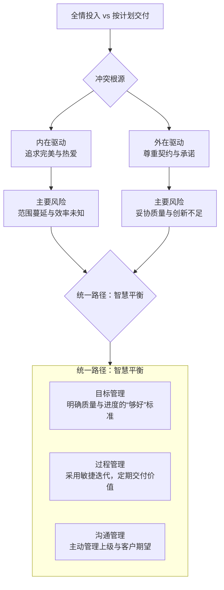

这是一个非常经典且普遍的职业困境，反映了**理想主义的工作品质**与**现实主义的商业约束**之间的张力。这两者并非绝对对立，但在资源有限的情况下，它们常常会形成一种需要权衡的张力。

<!--more-->

我们先通过下面的表格来概览它们的核心特征与冲突：

### 🆚 核心特征对比

| 维度 | **全情投入** | **按计划交付** |
| :--- | :--- | :--- |
| **核心理念** | **质量/完美主义导向**：追求极致，不留遗憾 | **契约/信誉导向**：言出必行，兑现承诺 |
| **工作模式** | 沉浸式、探索性、可能超出范围 | 纪律性、聚焦、严格遵守计划 |
| **主要风险** | **范围蔓延**、**效率未知**、可能错过市场窗口 | **妥协质量**、**创新不足**、用户满意度可能受损 |
| **主要优势** | 可能产生**突破性成果**、**卓越的质量**、团队成就感强 | **建立可靠信誉**、**资源可控**、利于长期规划 |
| **适用场景** | 研发、创作、解决关键难题、核心竞争力构建 | 大型协作、有明确截止日的项目、客户交付 |

---

### 🎯 深入解析两种模式

#### **“全情投入”模式**
这种模式源于对工作的热爱和追求卓越的内在驱动。
- **思维模式**：“这不仅仅是一个任务，这是一个作品。” 驱动者往往是**工匠精神**或对某个领域有极致热情的人。
- **潜在风险**：容易陷入“**过度工程**”或“**完美主义陷阱**”。花费80%的精力去打磨那最后20%并非最关键细节，导致投入产出比急剧下降。在商业环境中，这可能被视为缺乏边界感和成本意识。

#### **“按计划交付”模式**
这种模式源于职业精神和对外部承诺的尊重。
- **思维模式**：“Deadline是第一生产力。” 驱动者往往是**结果导向**和具有高度**责任感**的人。
- **潜在风险**：可能为了赶工而**偷工减料**，产生技术债务，从长期看反而降低了整体效率。极端情况下，会交付一个“半成品”，损害品牌信誉和用户满意度。

---

### 🔗 如何寻求平衡与统一？

真正的专业精神不在于二选一，而在于**在理解张力根源的基础上，实现动态的、智慧的平衡**。下图揭示了两者冲突的根源，并指明了统一的路径：

要实现图中所示的平衡，关键在于以下实践：

1.  **目标管理：明确“质量阶梯”**
    *   在项目开始前，就和团队或客户明确：什么是 **“必须完美”** 的核心（例如：产品的支付流程），什么是 **“足够好”** 即可的部分（例如：后台管理页面的UI）。
    *   应用**最小可行产品（MVP）** 思维，先交付核心价值，再基于反馈迭代优化。

2.  **过程管理：采用敏捷迭代**
    *   将大项目拆解为以周或双周为单位的短周期冲刺。每个冲刺都要求“全情投入”以交付一个可用的增量，同时也保证了“按计划”有持续的输出。
    *   这样既满足了“按计划交付”（小计划）的节奏感，也为“全情投入”划定了时间和范围的盒子。

3.  **沟通管理：主动管理期望**
    *   当你预见到“全情投入”可能需要更多时间时，**务必提前沟通**，而不是在截止日才说做不到。
    *   向项目经理或客户展示你的发现和权衡：**“如果我们多花3天，可以把性能提升50%，用户体验会更好。您认为这值得调整计划吗？”** 这样就将单向的交付压力，转变为双向的商业决策。

### 💎 核心总结

- **全情投入是“发动机”**，代表了工作的深度和热情。
- **按计划交付是“方向盘和刹车”**，代表了工作的纪律和边界。

**成熟的专业人士**不是在这两者间痛苦地选择，而是：
**在边界内全情投入，并通过沟通智慧地重新定义边界。**

最终，你的目标不是成为一个“永不延误的完美主义者”，也不是一个“只会赶工的流水线工人”，而是一个**既可靠又能创造惊喜的、值得信赖的合作伙伴**。
